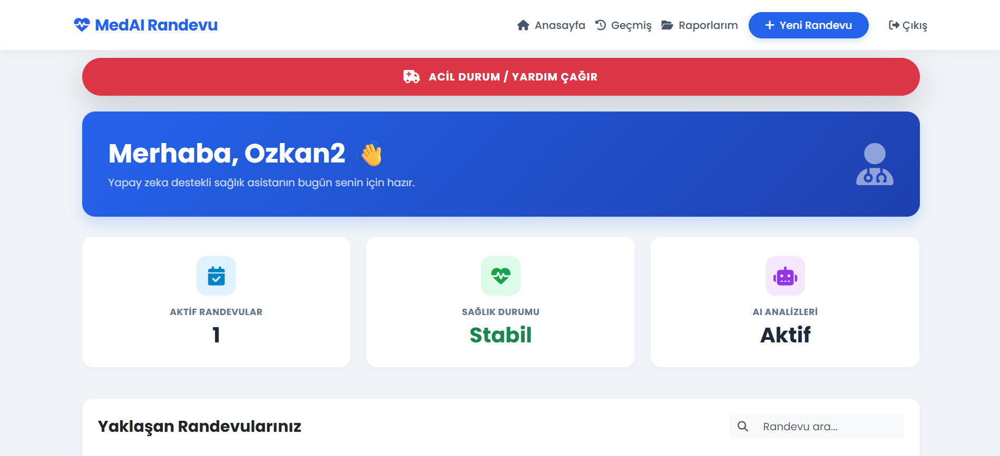
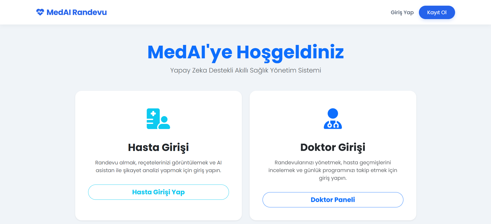
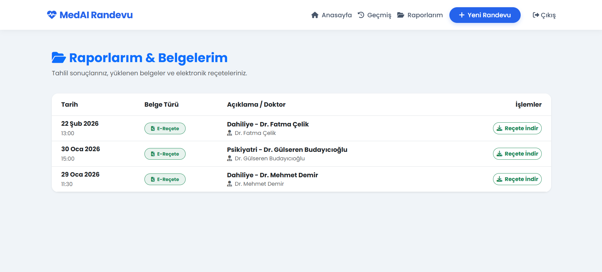
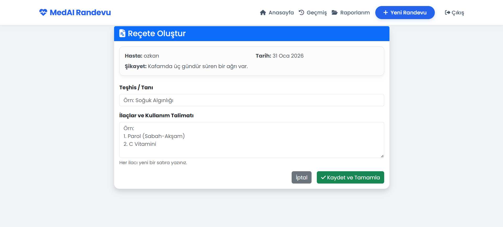
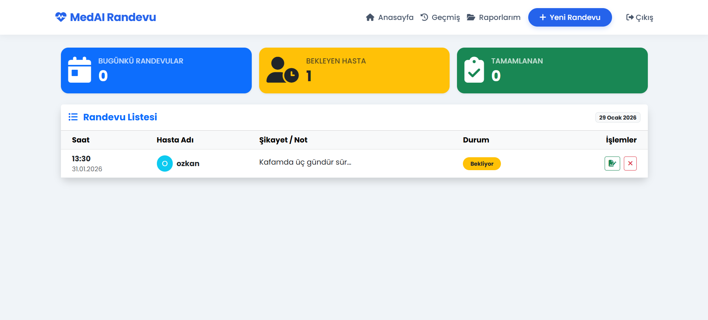

# 🏥 MedAI - Akıllı Hastane Randevu ve Yönetim Sistemi

MedAI, Django altyapısı ile geliştirilmiş; doktor, hasta ve yöneticiler için özelleştirilmiş paneller sunan, **PDF reçete üretebilen** ve **Yapay Zeka (AI)** destekli özelliklere sahip kapsamlı bir hastane otomasyonudur.


*(Buraya dashboard veya ana sayfa resmini koy)*

---

## 🚀 Projenin Temel Özellikleri

### 🔐 1. Güvenlik ve Yetkilendirme (Auth System)
* **Rol Tabanlı Giriş:** Kullanıcı giriş yaptığında sistem otomatik olarak **Doktor** mu yoksa **Hasta** mı olduğunu algılar ve ilgili panele yönlendirir ("Trafik Polisi" Mantığı).
* **Güvenli Kayıt:** Yeni kullanıcı oluşturma ve şifreleme işlemleri.

### 👨‍⚕️ 2. Doktor Modülü
* **Randevu Yönetimi:** Doktorlar kendilerine gelen randevuları tarih ve saat sırasına göre görür.
* **Elektronik Reçete Sistemi:** Muayene sonrası hastaya tanı koyma ve ilaç yazma ekranı.
* **Reçete Onayı:** Yazılan reçete sonrası randevuyu tek tuşla "Tamamlandı" statüsüne çekme.

### 👤 3. Hasta Modülü
* **Akıllı Dashboard:** Yaklaşan randevular, sağlık durumu özeti ve hızlı işlem menüsü.
* **Kolay Randevu:** Branş ve doktor seçerek uygun saatlere randevu alma.
* **Geçmiş Takibi:** Tamamlanan veya iptal edilen eski randevuların arşivlenmesi.
* **Raporlar ve Belgeler:** Yazılan reçeteleri ve tahlil sonuçlarını tek sayfada görüntüleme.
* **PDF Çıktısı:** Reçeteleri resmi formatta, ıslak imzalı görünüme sahip **PDF olarak indirme** özelliği.
* **🚨 Acil Durum Butonu:** Tek tıkla acil durum ekranına geçiş ve simülasyon.

### 🛠 4. Yönetim ve Arka Plan
* **Admin Paneli:** Doktor ekleme, branş düzenleme ve kullanıcı yönetimi için Django Admin arayüzü.
* **Otomatik Arşivleme:** Tarihi geçen randevuların otomatik olarak "Geçmiş" sayfasına taşınması.
* **Responsive Tasarım:** Telefon, tablet ve bilgisayarda uyumlu modern arayüz (Bootstrap 5).

---

## 📸 Projeden Ekran Görüntüleri

| Sistem Giriş Paneli | PDF Reçete Çıktısı |
|--------------------------|--------------------|
|  |  |

| Doktor Reçete Yazma Ekranı | Doktor Paneli |
|----------------------------|--------------------|
|  |  |

---

## 💻 Kurulum ve Çalıştırma

Projeyi kendi bilgisayarınızda çalıştırmak için aşağıdaki adımları izleyebilirsiniz:

1. **Projeyi Klonlayın:**
   ```bash
   git clone [https://github.com/Ozkan-Simsek/HastaneRandevu.git](https://github.com/Ozkan-Simsek/HastaneRandevu.git)
   cd HastaneRandevu
2. Sanal Ortamı Kurun (Opsiyonel ama Önerilir):
   python -m venv venv
   Windows:
   venv\Scripts\activate
   Mac/Linux:
   source venv/bin/activate
   
3. Gerekli Kütüphaneleri Yükleyin:
   pip install -r requirements.txt
   
4. Veritabanını Oluşturun:
    python manage.py migrate

5. Admin Kullanıcısı Oluşturun (Opsiyonel):
    python manage.py createsuperuser

6. Sunucuyu Başlatın:
   python manage.py runserver
   Tarayıcıda http://127.0.0.1:8000/ adresine gidin.

**Geliştirici:** Özkan Şimşek
